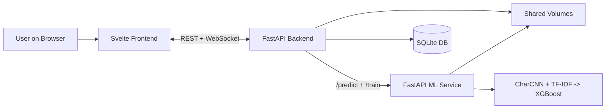

# 🛡️ Thai-Stylometry Identity Continuous Authentication

ระบบรักษาความปลอดภัยยุคใหม่ที่พิสูจน์ตัวตนผู้ใช้แบบต่อเนื่อง (Continuous Authentication) ด้วยเทคโนโลยี **Stylometry (การวิเคราะห์สไตล์การพิมพ์)** สำหรับระบบแชตภาษาไทยแบบเรียลไทม์


---

## 🎯 1) Project Overview

**Continuous Authentication via Stylometry คืออะไร?**
แทนที่จะพึ่งพาการ "ล็อกอินด้วยรหัสผ่านแค่ครั้งเดียว" โปรเจกต์นี้ใช้ Machine Learning เฝ้าดูรูปแบบการพิมพ์ข้อความ (Stylometric signals) ระหว่างแชต และอัปเดต **Trust Score** แบบต่อเนื่องผ่าน WebSocket ทันทีที่พบพฤติกรรมการพิมพ์ที่ผิดปกติ (เช่น โจรแอบสวมรอย) ระบบจะทำการล็อก Session อัตโนมัติ

**ความท้าทายหลัก:** การวิเคราะห์ประโยคแชตสั้นๆ (Short-text) ในภาษาไทยมีความทับซ้อนสูง โปรเจกต์นี้จึงใช้สถาปัตยกรรม **Late Fusion (XGBoost + CharCNN)** และกฎการให้คะแนนแบบ **Gray Zone** เพื่อรักษาสมดุลระหว่างความปลอดภัย (เตะโจร) และประสบการณ์ผู้ใช้ (ไม่เตะเจ้าของบัญชีเวลาพิมพ์ผิด)

---

## 🏗️ 2) Architecture & Tech Stack

ระบบออกแบบเป็น Microservices เต็มรูปแบบ เพื่อแยกการทำงานฝั่ง Web และ ML ออกจากกัน



**Tech Stack:**
* **Frontend:** Svelte, Vite, Tailwind CSS, DaisyUI
* **Backend:** FastAPI, SQLAlchemy, WebSocket, JWT Auth
* **ML Service:** FastAPI, PyTorch, scikit-learn, XGBoost
* **Deployment:** Docker & Docker Compose

---

## 🧠 3) The Trust Score Logic (Core Innovation)

ระบบใช้แนวคิด "การประเมินจากหลายมิติ" เพื่อลดปัญหา False Acceptance (ปล่อยโจรหลุด) และ False Rejection (เตะคนดี)

* **🌱 Grace Period (20 Messages):** เก็บข้อมูลตั้งต้น (Baseline) 20 ข้อความแรก เพื่อเทรนโมเดล XGBoost เฉพาะตัวบุคคล
* **📊 Gray Zone Evaluation:** ทุกข้อความที่ส่งเข้ามา จะถูกประเมินคะแนนความมั่นใจ (Confidence Score) ทันที:
  * 🟢 **Green Zone (> 0.85):** ตรงกับสไตล์เจ้าของบัญชี -> `+5 คะแนน`
  * ⚪ **Gray Zone (0.50 - 0.85):** ไม่แน่ใจ หรือพิมพ์คำศัพท์ใหม่ -> `ไม่หักคะแนน (ลดปัญหาคนดีโดนเตะ)`
  * 🔴 **Red Zone (< 0.50):** ตรวจพบความผิดปกติระดับโครงสร้างตัวอักษร -> `หัก 10-25 คะแนน`
* **🔒 Session Lock:** หาก Trust Score ลดลงต่ำกว่าเกณฑ์ ระบบจะเตะผู้ใช้ออกจาก WebSocket ทันที

---

## 🚀 4) Installation (Docker - Recommended)

วิธีที่ง่ายและรวดเร็วที่สุดคือการรันผ่าน Docker ทุกอย่างถูกตั้งค่าไว้เรียบร้อยแล้ว

**Prerequisites:**
* ติดตั้ง [Docker Desktop](https://www.docker.com/products/docker-desktop/)

**Step-by-step:**

1. **Clone the repository:**
   ```bash
   git clone <your-repo-url>
   cd stylometry-chat2
   ```

2. **Start the services:**
   ```bash
   docker compose up --build
   ```
   *(รอจนกว่าจะขึ้นคำว่า `Application startup complete`)*

3. **Access the application:**
   * **Frontend (ใช้งานแชต):** http://localhost:5173
   * **Backend API (Swagger):** http://localhost:8000/docs
   * **ML Service API:** http://localhost:8001/docs

4. **To stop the services:**
   ```bash
   docker compose down
   ```

---

## 🧪 5) Automated Testing (Auto-Injector)

เรามีบอทจำลองการพิมพ์ผ่าน WebSocket เพื่อใช้ทดสอบความแม่นยำของระบบและพฤติกรรมของ Trust Score

**Prerequisites:** เปิด Terminal ใหม่ (ไม่ต้องปิด Docker) และติดตั้ง Library ที่จำเป็น
```bash
python3 -m venv venv_scripts
source venv_scripts/bin/activate
pip install -r scripts/requirements.txt
```

**How to test:**
1. สมัครสมาชิกและล็อกอินผ่านหน้าเว็บ (http://localhost:5173)
2. ก๊อปปี้ **JWT Token** (หาได้จาก Network tab หรือ Log ใน Terminal Backend)
3. รันสคริปต์จำลองการพิมพ์ (เลือกยิงข้อความคนดี หรือ ข้อความโจร):

*ยิงข้อมูลคนดี (สร้าง Baseline):*
```bash
python3 scripts/auto_injector.py --token "<YOUR_JWT_TOKEN>" --file scripts/data/good_messages.txt --count 350 --security_on
```

*ยิงข้อมูลโจร (ทดสอบระบบเตะ):*
```bash
python3 scripts/auto_injector.py --token "<YOUR_JWT_TOKEN>" --file scripts/data/impostor_messages.txt --count 10 --security_on
```

---

## 🤖 6) Offline Pre-training (For Advanced Users)

เพื่อให้โมเดล **CharCNN** จับผิดโจรได้แม่นยำที่สุด (ดึงพลัง 128-dim features) คุณจำเป็นต้องเทรน Base Model ด้วยข้อมูลแชตมหาศาลของคุณเองก่อนเริ่มใช้งานระบบ

1. รวบรวมข้อมูลแชต (เช่น จาก Instagram JSON export) ไว้ในโฟลเดอร์
2. รันสคริปต์เทรน (ผ่าน venv):
   ```bash
   python3 scripts/train_cnn_offline.py --inbox_dir "/path/to/your/json/inbox" --owner_name "Your Name" --epochs 5
   ```
3. สคริปต์จะสร้างไฟล์ `base_char_cnn.pth` และ `base_char_cnn_vocab.json` ไว้ในโฟลเดอร์ ML Service โดยอัตโนมัติ
4. รัน `docker compose up --build` ใหม่อีกครั้งเพื่อโหลด Weights เข้าสู่ระบบ

---

## 🔐 Security Notes & Future Works

* โค้ดชุดนี้พัฒนาขึ้นเพื่อเป็น **Proof of Concept / Academic Research**
* `SECRET_KEY` และฐานข้อมูล SQLite ในโปรเจกต์ ถูกตั้งค่าไว้สำหรับการทดสอบในโหมด Development เท่านั้น
* **Future Works:** สามารถต่อยอดทำ Dashboard สรุปผล Trust Score แบบเรียลไทม์ หรือทำ A/B Testing เพื่อหาค่า Hyperparameter ที่เหมาะสมที่สุดในแต่ละองค์กร
```
